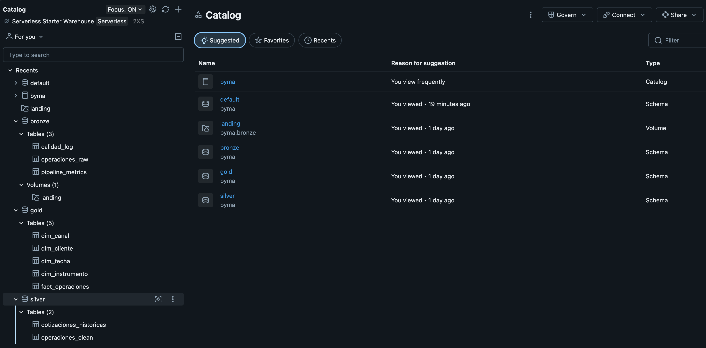

# BYMA Market Data Pipeline

Pipeline de procesamiento de operaciones bursátiles desarrollado sobre **Databricks Free Edition** utilizando **Unity Catalog**, **Apache Spark** y **Delta Lake**, implementando una arquitectura **Lakehouse** con las capas **Bronze**, **Silver** y **Gold**.

El proyecto transforma un proceso batch basado en archivos CSV en un pipeline analítico organizado, incorporando validaciones de calidad, enriquecimiento con información de mercado, observabilidad y un modelo dimensional para análisis de negocio.

---

# Objetivo

Construir un pipeline de datos que permita:

* Ingestar operaciones bursátiles desde archivos CSV.
* Aplicar controles de calidad sobre los datos recibidos.
* Limpiar y estandarizar la información.
* Enriquecer las operaciones con cotizaciones históricas provenientes de APIs externas.
* Construir un modelo dimensional para análisis.
* Facilitar consultas analíticas y exploración de datos.

---

# Arquitectura

El proyecto fue desarrollado utilizando **Databricks Free Edition** con **Unity Catalog** como catálogo central para la administración de tablas y esquemas.

Se implementó una arquitectura Lakehouse organizada en tres capas:

A[CSV BYMA]
--> B[Bronze]

B --> C[Silver]

C --> D[Gold]

D --> E[Business Analytics / SQL / EDA]

## Bronze

* Ingesta del archivo CSV original.
* Conservación del dato sin modificaciones.
* Primeras validaciones de calidad.
* Persistencia en formato Delta.

---

## Silver

* Limpieza de registros.
* Normalización de tipos de datos.
* Cálculo del monto total por operación.
* Detección de fines de semana.
* Detección de outliers.
* Enriquecimiento con cotizaciones históricas mediante **yfinance**.
* Manejo robusto de errores y degradación elegante ante fallas de la API.

---

## Gold

Construcción del modelo dimensional compuesto por:

### Dimensiones

* dim_fecha
* dim_canal
* dim_instrumento
* dim_cliente (SCD Tipo 2)

### Tabla de hechos

* fact_operaciones

El modelo permite responder consultas analíticas de forma eficiente siguiendo un esquema estrella.

---

# Data Quality

Durante la ingestión y transformación se implementaron controles de calidad sobre:

* Valores nulos en campos críticos.
* Registros duplicados.
* Tipos de datos.
* Cantidades y precios inválidos.
* Outliers sobre el monto total.
* Validaciones posteriores a la escritura de cada capa.

---

# Enriquecimiento con datos externos

Para enriquecer las operaciones se utilizó la librería **yfinance**.

Se implementaron mecanismos para:

* Retry con backoff exponencial.
* Mapeo de tickers locales.
* Manejo de tickers sin cotización.
* Registro de la fuente consultada.
* Degradación elegante sin detener el pipeline.

Las cotizaciones históricas se almacenan en:

byma.silver.cotizaciones_historicas

---

# Observabilidad

Se implementó una tabla de monitoreo que registra cada etapa del pipeline.

Información registrada:

* etapa
* tabla
* filas_procesadas
* timestamp_ejecucion

Tabla:

byma.monitoring.pipeline_metrics

---

# Exploratory Data Analysis (EDA)

Se realizaron consultas exploratorias sobre el modelo Gold para analizar:

* Distribución de operaciones por tipo.
* Instrumentos más operados.
* Volumen negociado por instrumento.
* Evolución diaria del monto operado.
* Clientes más activos.

---

# Estructura del proyecto

.
├── data/
│   └── operaciones.csv
│
├── notebooks/
│   ├── 01_bronze_ingestion.py
│   ├── 02_silver_processing.py
│   ├── 03_gold_model.py
│   ├── 04_business_questions.py
│   ├── 05_market_prices_enrichement.py
│   ├── 06_observability.py
│   └── 07_eda.py
│
├── requirements.txt
├── .gitignore
└── README.md

---

# Tecnologías utilizadas

* Databricks Free Edition
* Unity Catalog
* Apache Spark
* Delta Lake
* yfinance
* Git

---

# Ejecución

Las notebooks deben ejecutarse respetando el orden descrito en Estructura del proyecto

Cada notebook genera las tablas necesarias para la siguiente etapa del pipeline.

---

# Modelo de datos

El modelo final implementa un esquema estrella compuesto por:

* Fact Operaciones
* Dim Fecha
* Dim Canal
* Dim Instrumento
* Dim Cliente (SCD Tipo 2)

orientado a consultas analíticas y resolución de preguntas de negocio.

## Uso de IA

Durante el desarrollo se utilizó asistencia mediante un LLM como herramienta de apoyo técnico. El detalle del alcance y los criterios de validación se encuentran en `IA_ASSIST.md`.

### Entorno de desarrollo

El proyecto fue implementado utilizando **Databricks Free Edition** con **Unity Catalog**, organizando los datos en catálogos, esquemas y tablas Delta.

